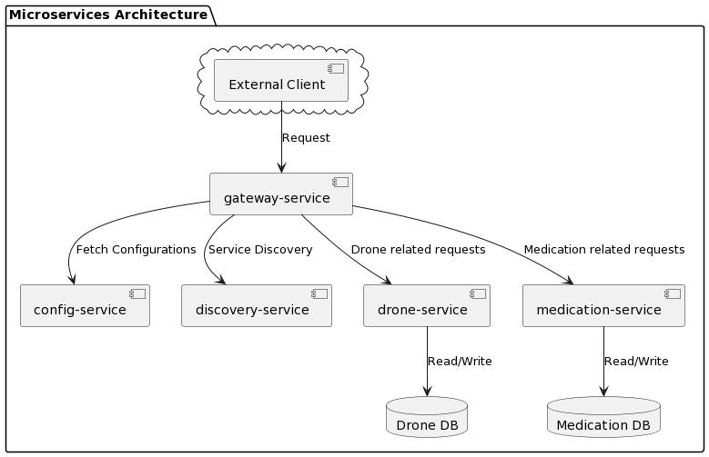

# Drones

---

### Introduction

There is a major new technology that is destined to be a disruptive force in the field of transportation: **the drone**.
Just as the mobile phone allowed developing countries to leapfrog older technologies for personal communication, the
drone has the potential to leapfrog traditional transportation infrastructure.

Useful drone functions include delivery of small items that are (urgently) needed in locations with difficult access.

# Getting Started

---

## Usage

Build the apps with images:

```shell
./gradlew clean assemble jibDockerBuild
```

Then run all the containers with `docker-compose`:

```shell
docker-compose up
```

* Open [Eureka](http://localhost:8061/) in browser to enter Eureka
* Open [Swagger](http://localhost:8060/webjars/swagger-ui/index.html) in browser to open Swagger for all services
* Open [Zipkin](http://localhost:9411/zipkin/) in browser to enter Zipkin

---

## Architecture

Our sample microservices-based system consists of the following modules:

- **gateway-service** - a module that Spring Cloud Netflix Zuul for running Spring Boot application that acts as a
  proxy/gateway in our architecture.
- **config-service** - a module that uses Spring Cloud Config Server for running configuration server in the `native`
  mode. The configuration files are placed on the classpath.
- **discovery-service** - a module that depending on the example it uses Spring Cloud Netflix Eureka or Spring Cloud
  Netlix Alibaba Nacos as an embedded discovery server.
- **drone-service** - a microservice responsible for managing drones and their interactions. It supports operations such
  as registering a drone, checking the loaded medication items on a drone, checking available drones for loading, and
  inspecting the battery level of a drone. The service is closely integrated with the medication-service to ensure that
  the medications loaded onto the drones are validated and managed correctly. Special checks are in place to ensure that
  a drone isn't overloaded beyond its weight capacity and that its battery level is adequate before loading.
- **medication-service** - A microservice dedicated to managing medications. It provides details about different
  medications, including their names, weights, codes, and images. This service is crucial in the process of loading
  drones, as the drone-service queries it to validate the list of medications it's tasked to carry. The service ensures
  that the medications are available and provides their weight details to the drone service for loading validations. It
  also associates certain medications with specific drones upon successful loading.

The following picture illustrates the architecture described above.


## Todo List

For a more detailed list of tasks and plans, please refer to the [Todo List](info/todo.md) file.

---

# Task description

We have a fleet of **10 drones**. A drone is capable of carrying devices, other than cameras, and capable of delivering
small loads. For our use case **the load is medications**.

A **Drone** has:
- serial number (100 characters max);
- model (Lightweight, Middleweight, Cruiserweight, Heavyweight);
- weight limit (500gr max);
- battery capacity (percentage);
- state (IDLE, LOADING, LOADED, DELIVERING, DELIVERED, RETURNING).

Each **Medication** has:

- name (allowed only letters, numbers, ‘-‘, ‘_’);
- weight;
- code (allowed only upper case letters, underscore and numbers);
- image (picture of the medication case).

Develop a service via REST API that allows clients to communicate with the drones (i.e. **dispatch controller**). The
specific communicaiton with the drone is outside the scope of this task.

The service should allow:
- registering a drone;
- loading a drone with medication items;
- checking loaded medication items for a given drone;
- checking available drones for loading;
- check drone battery level for a given drone;

> Feel free to make assumptions for the design approach.

---

### Requirements

While implementing your solution **please take care of the following requirements**:

#### Functional requirements

- There is no need for UI;
- Prevent the drone from being loaded with more weight that it can carry;
- Prevent the drone from being in LOADING state if the battery level is **below 25%**;
- Introduce a periodic task to check drones battery levels and create history/audit event log for this.

---

#### Non-functional requirements

- Input/output data must be in JSON format;
- Your project must be buildable and runnable;
- Your project must have a README file with build/run/test instructions (use DB that can be run locally, e.g. in-memory,
  via container);
- Any data required by the application to run (e.g. reference tables, dummy data) must be preloaded in the database;
- Unit tests;
- Use a framework of your choice, but popular, up-to-date, and long-term support versions are recommended.

---
